# SSH CTF Writeup

## Overview:

This Secure Shell (SSH) Capture-The-Flag (CTF) consists of a vulnerable DNS Lookup webapp with Remote Code Execution capabilities. Exploiting the RCE allows one to obtain the flag from a  `user.txt` document, as well as sensitive credentials for the `root` user on the server machine. The attacker can then use those credentials to `ssh` into the machine, thereby capturing the `root.txt` flag. 

Below will be a short outline on how to do so:


### Step 1: Reconnaissance 

The first step in any pentest is reconnaissance: understanding the application, and its associated attack surfaces. First, we run `nmap` on the target machine:

We have identified a host with ports 80, 443, and 22 open to the public, indicating web hosting and SSH are enabled. We navigate to our browser and enter: `http://ip_address:80` and view the web page:

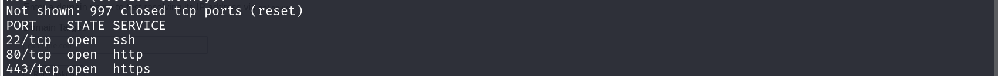


It is an `nslookup` tool that seems to be taking user input and passing it as a parameter in the `nslookup` utility. We can append another command to our input using the `&&` or `||` operators.


Let's try a simple test query: `google.com`

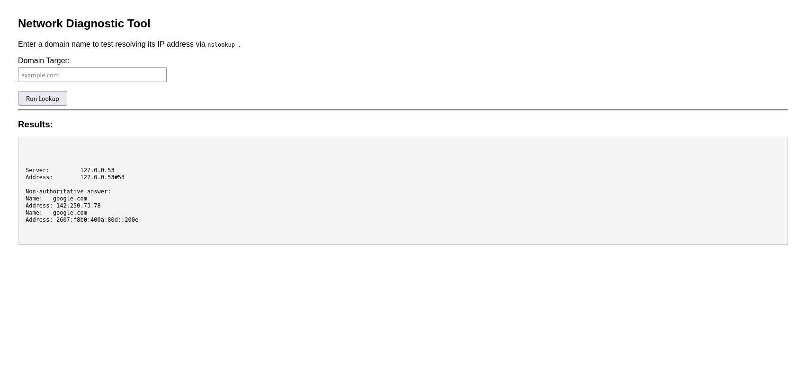


We can test for an RCE vulnerability by entering: `google.com && ls` and observing the results:


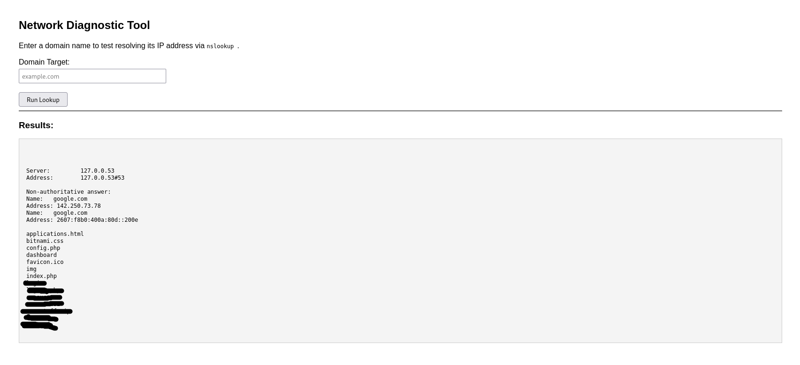

It seems as though RCE (Remote-Code Execution) is, indeed, possible.


### Step 2: Exploitation

Now that we have identified a vulnerability, it is time to exploit it. Let's first figure out what user we're running as:

```google.com && whoami```


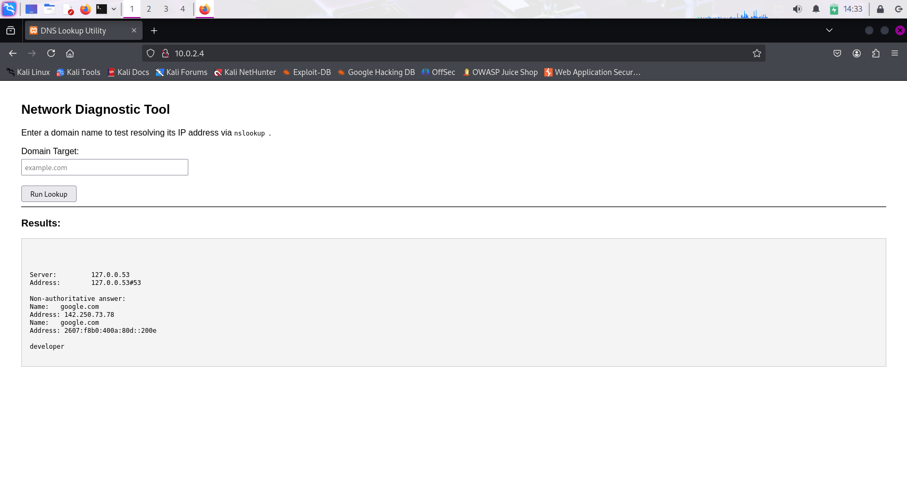

It looks like the webserver is running as the `developer` user. Let's keep that in mind.


We will next determine what directory we are in with this command.

```google.com && pwd```

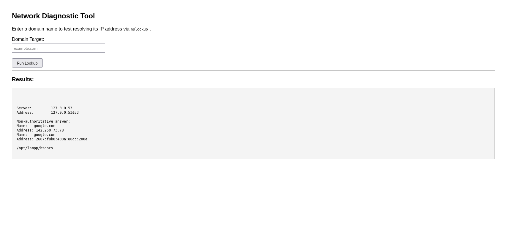

We can see that we are in the `htdocs` folder of `lampp`. We can now run this command:

```google.com && cd /home/ && ls```

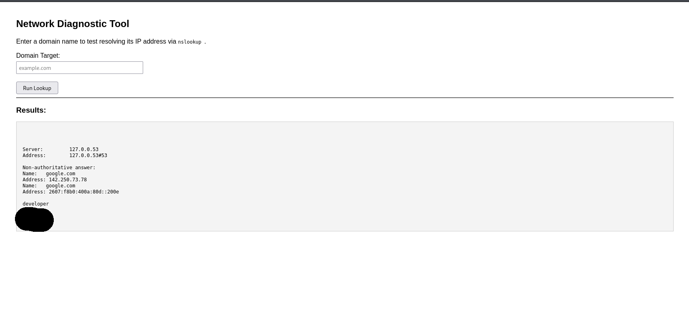

We now see the user account of the service running the web server. Let's `cd` into that.

```google.com && cd /home/developer/ && ls ```

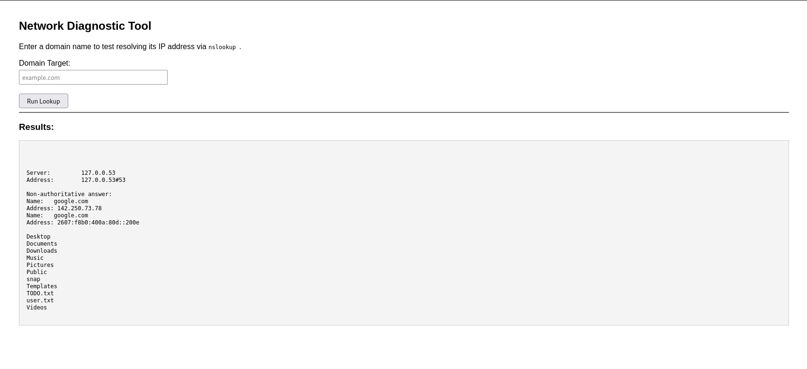


This shows us that a `user.txt` file exists, as does a mysterious `TODO.txt` file. Let's read the `user.txt` file first, since user flags are typically contained in those. We can do this with:

```google.com && cd /home/developer/ && cat user.txt```

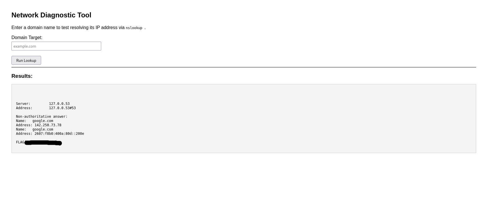

We have the flag!

Now let's read that other file.

```google.com && cd /home/developer/ && cat TODO.txt```

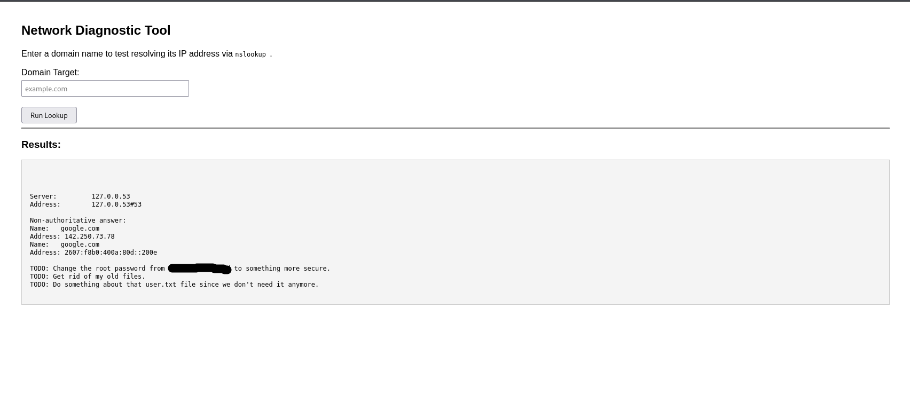

This tells us what the root password is. We can now open a terminal and run:

```ssh -p 22 root@ip_address```

And when prompted, enter the discovered password. Now we have root access. We can run `ls` to see what files are present on the filesystem. The most important one there is `root.txt`.

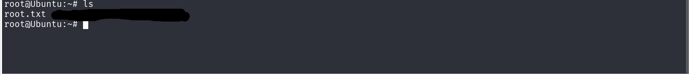

Running `cat root.txt` shows us the flag.

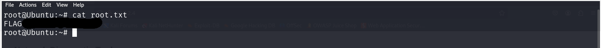


We've done it! RCE exploitation and privilege escalation, complete!

If you want to download the source code and try this challenge out for yourself, see [here.](https://github.com/Tori-Tech/ssh-ctf)
